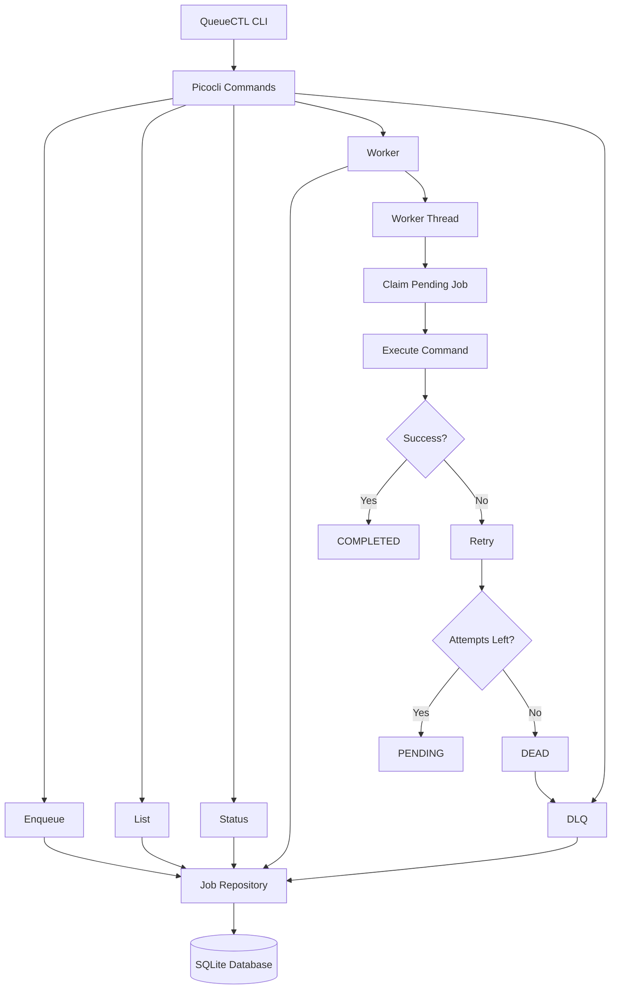
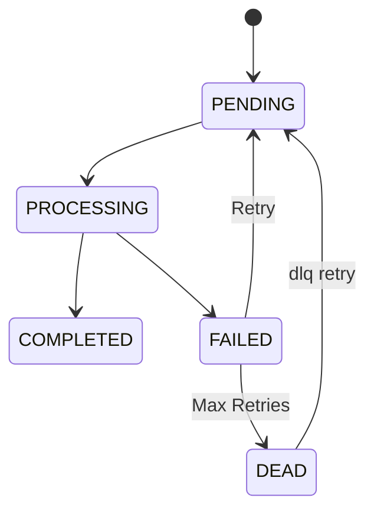

# QueueCTL


> **A CLI-based Background Job Queue System built in Java**

QueueCTL is a lightweight background job processing system inspired by popular job queue frameworks like **Sidekiq**, **Celery**, and **BullMQ**. It provides asynchronous job execution, persistent job storage, multiple worker support, retry handling with exponential backoff, and a Dead Letter Queue (DLQ) for failed jobs.

The project is built completely in **Java 21** using **Picocli**, **SQLite**, and **JDBC**, demonstrating concepts such as multithreading, concurrent job processing, persistence, and fault tolerance.

---

# Table of Contents

- Overview
- Features
- System Architecture
- Technology Stack
- Project Structure
- Installation
- Build Instructions
- Running the Application
- CLI Commands
- Example Workflow
- Job Lifecycle
- Retry Mechanism
- Dead Letter Queue
- Internal Architecture
- Future Improvements
- Screenshots
- Design Decisions
- Author

---

# Overview

Background job queues are used to execute long-running or asynchronous tasks without blocking the main application.

Instead of executing a task immediately, QueueCTL stores the job inside a persistent SQLite database. Worker threads continuously monitor the queue, claim pending jobs atomically, execute them, retry failed jobs with exponential backoff, and finally move permanently failed jobs into a Dead Letter Queue.

This project demonstrates several backend engineering concepts commonly used in production systems.

---

# Features

## Job Queue

- Enqueue jobs using JSON input
- Persistent job storage using SQLite
- FIFO job scheduling

---

## Worker System

- Single worker execution
- Multiple concurrent workers
- Atomic job claiming
- Background processing

---

## Retry Mechanism

- Automatic retries on failure
- Configurable maximum retries
- Exponential backoff strategy

Example:

```
Attempt 1 → wait 2 seconds
Attempt 2 → wait 4 seconds
Attempt 3 → DEAD
```

---

## Dead Letter Queue (DLQ)

Jobs that exceed their retry limit are automatically moved into the Dead Letter Queue.

Features include:

- View dead jobs
- Retry dead jobs
- Reset attempt count
- Re-queue failed jobs

---

## Queue Monitoring

- View all jobs
- Filter jobs by state
- View queue statistics

---

## Persistence

Jobs survive application restarts because they are stored in SQLite.

---

## Command Line Interface

Built using **Picocli**.

Supports multiple commands and subcommands.

---

#  System Architecture


---

#  Technology Stack

| Technology | Purpose |
|------------|---------|
| Java 21 | Core programming language |
| Maven | Dependency management |
| SQLite | Persistent job storage |
| JDBC | Database access |
| Picocli | Command-line interface |
| Jackson | JSON parsing |

---

#  Project Structure

```
QueueCTL
│
├── src
│   ├── main
│   │   ├── java
│   │   │
│   │   ├── cli
│   │   ├── config
│   │   ├── model
│   │   ├── repository
│   │   ├── util
│   │   └── worker
│   │
│   └── resources
│
├── queue.db
├── pom.xml
└── README.md
```

---

#  Installation

Clone the repository.

```bash
git clone https://github.com/<your-username>/QueueCTL.git

cd QueueCTL
```

---

#  Build

Compile the project using Maven.

```bash
mvn clean package
```

After a successful build, Maven generates the executable JAR inside the `target` directory.

---

#  Running the Application

Display available commands:

```bash
java -jar target/queuectl-1.0-SNAPSHOT.jar --help
```

---

#  CLI Commands

## Enqueue Job

```bash
java -jar target/queuectl-1.0-SNAPSHOT.jar enqueue "{\"id\":\"job1\",\"command\":\"echo Hello\"}"
```

---

## List All Jobs

```bash
java -jar target/queuectl-1.0-SNAPSHOT.jar list
```

---

## Filter Jobs

```bash
java -jar target/queuectl-1.0-SNAPSHOT.jar list --state DEAD
```

Possible states:

- PENDING
- PROCESSING
- COMPLETED
- FAILED
- DEAD

---

## Queue Status

```bash
java -jar target/queuectl-1.0-SNAPSHOT.jar status
```

Displays:

- Pending jobs
- Processing jobs
- Completed jobs
- Failed jobs
- Dead jobs
- Total jobs

---

## Start Workers

Start one worker:

```bash
java -jar target/queuectl-1.0-SNAPSHOT.jar worker start
```

Start multiple workers:

```bash
java -jar target/queuectl-1.0-SNAPSHOT.jar worker start --count 2
```

---

## Dead Letter Queue

View dead jobs:

```bash
java -jar target/queuectl-1.0-SNAPSHOT.jar dlq list
```

Retry a dead job:

```bash
java -jar target/queuectl-1.0-SNAPSHOT.jar dlq retry fail1
```

---

#  Example Workflow

### Step 1

Enqueue a job.

```bash
java -jar target/queuectl-1.0-SNAPSHOT.jar enqueue "{\"id\":\"job1\",\"command\":\"echo Hello\"}"
```

---

### Step 2

Start background workers.

```bash
java -jar target/queuectl-1.0-SNAPSHOT.jar worker start --count 2
```

---

### Step 3

Check queue.

```bash
java -jar target/queuectl-1.0-SNAPSHOT.jar list
```

---

### Step 4

Monitor queue.

```bash
java -jar target/queuectl-1.0-SNAPSHOT.jar status
```

---

### Step 5

Retry failed jobs.

```bash
java -jar target/queuectl-1.0-SNAPSHOT.jar dlq retry fail1
```

---

#  Job Lifecycle


##  Job Lifecycle




---

#  Retry Strategy

QueueCTL uses exponential backoff before retrying failed jobs.

```
Retry 1 → 2 seconds

Retry 2 → 4 seconds

Retry 3 → Dead Letter Queue
```

This prevents continuous rapid retries and mimics production queue systems.

---

#  Atomic Job Claiming

To prevent duplicate execution when multiple workers are running, QueueCTL atomically claims jobs before processing.

Only one worker can transition a job from **PENDING** to **PROCESSING**, preventing race conditions and duplicate execution.

---

##  Database Schema

| Column | Type | Description |
|---------|------|-------------|
| id | TEXT | Unique job identifier |
| command | TEXT | Command to execute |
| state | TEXT | Current job state |
| attempts | INTEGER | Retry attempts |
| max_retries | INTEGER | Maximum retries |
| created_at | TEXT | Creation timestamp |
| updated_at | TEXT | Last update timestamp |


---

#  Future Improvements

Potential enhancements include:

- Worker pause/resume
- Scheduled jobs
- Delayed jobs
- Cron support
- Priority queues
- REST API
- Web Dashboard
- Docker deployment
- Logging framework
- Metrics & monitoring

---

#  Screenshots

## CLI Help

_Add screenshot here_

---

## Job Processing

_Add screenshot here_

---

## Queue Status

_Add screenshot here_

---

## Dead Letter Queue

_Add screenshot here_

---

##  Design Decisions

### Why SQLite?
SQLite provides lightweight, file-based persistence without requiring an external database server, making the project easy to set up and portable.

### Why Picocli?
Picocli simplifies building feature-rich command-line interfaces with support for subcommands, validation, and help generation.

### Why Atomic Job Claiming?
When multiple workers run concurrently, atomic job claiming ensures that a job is processed by only one worker, preventing duplicate execution and race conditions.

### Why Exponential Backoff?
Exponential backoff avoids repeatedly retrying failing jobs in rapid succession, reducing unnecessary resource usage and mirroring strategies used in production job queue systems.

#  Author

**Mohd Nazeeb Mansoori**

Java Backend Developer

## LinkedIn: https://linkedin.com/in/mohd-nazeeb-mansoori
## LeetCode: https://leetcode.com/u/MohdNazeeb
---
